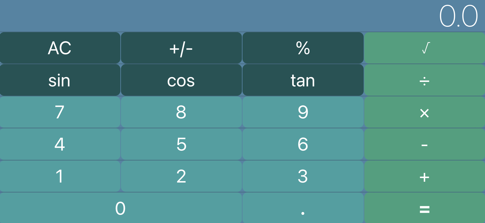

## iOS Calculator App 
This application is a basic calculator for iOS devices which used Swift programming language and Xcode. This app was mainly created to get experience auto layering, handling buttons, and basic calculations. 




### How to use
:small_orange_diamond: Download source code
:small_orange_diamond: Unzip the downloaded folder
:small_orange_diamond: Open project in Xcode and play

**Using Terminal:**
```
  git clone https://github.com/acatarinaoaraujo/iOS-calculator.git
  ```
 ### Contact
 <em> In case you want to contribute to this app, send me an email at acoa_@hotmail.com.</em> :bulb:
